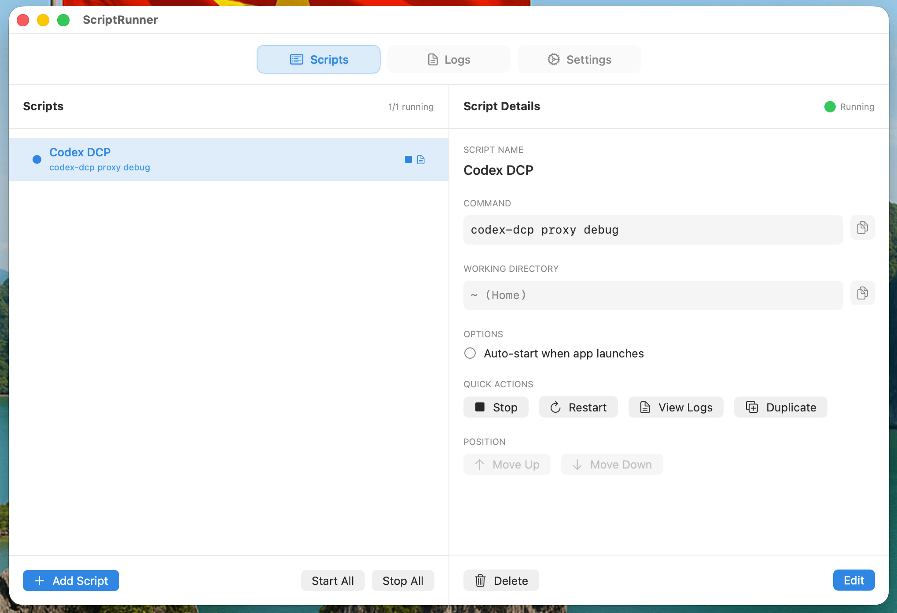

# ScriptRunner

A macOS Menu Bar application to manage and run scripts in the background.


[](https://github.com/hungcuong9125/ScriptRunner/actions/workflows/build.yml)



## Features

- 🖥️ **Menu Bar App** - Lives in your menu bar, always accessible
- ▶️ **Run Scripts** - Execute shell commands in the background
- 📊 **Status Indicators** - See running/stopped/crashed status at a glance
- 📜 **Real-time Logs** - View stdout/stderr with search, auto-scroll, and copy
- ⚡ **Auto-start** - Automatically run selected scripts when app launches
- 🔔 **Notifications** - Get notified when scripts crash
- 💾 **Export/Import** - Backup and share your script configurations
- 📋 **Duplicate Scripts** - Quick duplicate with one click
- 🗑️ **Force Kill** - Custom kill commands for stubborn processes

## Installation

### Download

Download the latest build from [Releases](https://github.com/hungcuong9125/ScriptRunner/releases).

### macOS Users

The app is not signed with an Apple Developer certificate yet. If macOS blocks the app:

```bash
xattr -cr /Applications/ScriptRunner.app
```

### Build from Source

1. Open `ScriptRunner.xcodeproj` in Xcode 15+
2. Select your development team in Signing & Capabilities
3. Build and run (Cmd+R)
4. Optionally, archive and export for distribution

### Requirements

- macOS 14.0 (Sonoma) or later
- Xcode 15+ for building

## Usage

### Adding a Script

1. Click the terminal icon in the menu bar
2. Click "+ Add Script" button
3. Fill in:
   - **Name**: A friendly name for your script
   - **Command**: The shell command to execute (e.g., `npm run dev`)
   - **Working Directory**: Where to run the command (optional, defaults to Home)
   - **Auto-start**: Enable to run automatically on app launch
   - **Kill Command**: Optional custom command to force stop the script

### Managing Scripts

- **Start/Stop**: Click the play/stop buttons on each script
- **Restart**: Available for running scripts
- **View Log**: Click the document icon to see output
- **Edit**: Click "Edit" button to modify script settings
- **Duplicate**: Create a copy of an existing script
- **Delete**: Remove scripts you no longer need
- **Reorder**: Move scripts up/down in the list

### Keyboard Shortcuts

| Shortcut | Action |
|----------|--------|
| Cmd+N | Add new script |
| Cmd+Shift+R | Start all scripts |
| Cmd+. | Stop all scripts |
| Cmd+Q | Quit application |

## Example Scripts

### MCP Servers

```
Name: GKG Server
Command: gkg server start
Working Directory: (leave empty)
Auto-start: Yes
```

```
Name: Mail Agent MCP
Command: scripts/run_server_with_token.sh
Working Directory: /Users/yourname/Developer/TOOLS/mcp_agent_mail
Auto-start: Yes
```

### Development Servers

```
Name: Frontend Dev
Command: npm run dev
Working Directory: /path/to/your/frontend
```

```
Name: Backend API
Command: python manage.py runserver
Working Directory: /path/to/your/backend
```

## Configuration

Scripts are stored in UserDefaults and persist between sessions.

### Export/Import

1. Open Settings (right-click menu bar icon > Settings)
2. Go to "Data" tab
3. Use Export to save to JSON file
4. Use Import to restore from JSON file

## Architecture

```
ScriptRunner/
├── ScriptRunnerApp.swift          # App entry point
├── AppDelegate.swift              # Lifecycle & notifications
├── Models/
│   ├── Script.swift               # Script data model
│   └── LogEntry.swift             # Log entry model & LogStore
├── ViewModels/
│   └── ScriptManager.swift        # Core business logic
├── Services/
│   ├── ShellExecutor.swift        # Shell command execution
│   └── WindowManager.swift        # Window management
├── Extensions/
│   ├── Cursor.swift               # Custom cursor modifiers
│   └── DateFormatter+ScriptRunner.swift  # Shared date formatter
└── Views/
    ├── MainWindowView.swift       # Main window with all tabs
    └── MenuBarView.swift          # Menu bar popover UI
```

## Recent Changes (v0.5.5)

- Fixed Stop not working — termination handler never cleaned up due to Date() comparison bug (nanosecond precision)
- Fixed Restart race condition — replaced timer-based restart with pendingRestartIds set, restart now triggers from terminationHandler after cleanup
- Added log-to-file — logs are now written to `~/Library/Logs/ScriptRunner/` in real-time
- Added "Open Log File" button in Logs tab footer to open log file in Finder
- App now shows main window (Scripts tab) centered on screen at launch instead of sitting silently in menu bar

## Recent Changes (v0.5.4)

- Fixed clear log button not working
- Fixed restart race condition with DispatchWorkItem cancellation
- Fixed weak memory captures in termination handlers
- Added UTF-8 buffer handling for proper encoding
- Added thread safety with NSLock for buffer operations
- Improved log viewer with search highlighting
- Added copy buttons for script details
- Added clear confirmation dialog
- Fixed NSCursor push/pop imbalance
- Added notification-based navigation from menu bar

## Troubleshooting

### Script won't start
- Check the working directory path exists
- Verify the command works in Terminal
- Check logs for error messages

### Logs not showing
- Ensure the script outputs to stdout/stderr
- Some scripts buffer output - try adding flush statements

### Notifications not working
- Grant notification permission in System Settings > Notifications

## License

MIT License - feel free to use and modify.

## Contributing

Contributions are welcome! Please open an issue or pull request.
